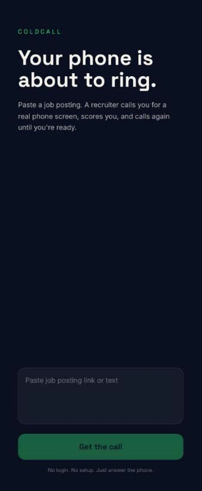
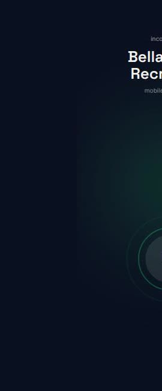
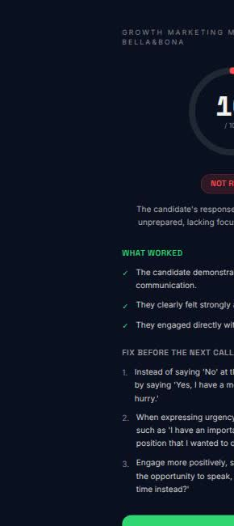

# ColdCall

**The recruiter that calls until you're ready.**

Paste a real job posting. Your phone rings — a full-screen incoming call from "{Company} Recruiting". An AI recruiter runs a real first-round phone screen tailored to that exact job, then scores you 0–100 with specific fixes quoting what you actually said. Tap "Call me again" and it calls back with sharper questions — until you're ready.

Built solo in one session at **8x Mobile Hack Berlin**.

| Home | Incoming call | Live interview | Feedback |
| --- | --- | --- | --- |
|  |  |  |  |

## Why it's different

Interview prep tools live on your laptop — dashboards, Zoom bots, onboarding flows. Interviews happen on your phone. ColdCall has zero setup (no login, no account) and flips the interaction: **the app calls you**. Real ringtone, real vibration, real pressure.

## How it works

1. **Paste** a job posting link or text → GPT extracts company, role, seniority, and top requirements (falls back to a demo job if parsing fails).
2. **Answer the call** — an ElevenLabs conversational agent, briefed via runtime overrides with a recruiter persona for that exact job, asks 4 tailored questions.
3. **Get scored** — the live transcript goes to GPT, which returns an honest 0–100 score, a verdict (NOT READY / ALMOST / READY), 3 strengths, and 3 concrete fixes referencing your actual answers.
4. **Call me again** — repeat rounds get harder until you hit READY (confetti included).

## Tech

- Next.js 14 (App Router) + TypeScript + Tailwind
- ElevenLabs Agents (`@elevenlabs/react`) for the live voice interview, with per-call system prompt + first message overrides
- OpenAI (gpt-4o-mini) for job parsing and interview scoring
- No database, no auth — React state + sessionStorage only

## Run it

```bash
npm install
cp .env.example .env.local   # fill in your keys
npm run dev                  # binds 0.0.0.0 — open http://<laptop-ip>:3000 on your phone
```

`.env.local`:

```
OPENAI_API_KEY=sk-...
NEXT_PUBLIC_ELEVENLABS_AGENT_ID=agent_...   # ElevenLabs agent with System prompt + First message overrides enabled
NEXT_PUBLIC_PUBLIC_URL=https://...          # optional: public https URL, shown as a QR code on the feedback screen
```

The mic requires a secure context on iOS — for phone demos tunnel the dev server (`npx localtunnel --port 3000`) and open the https URL.

## The ElevenLabs agent

Create an agent in the ElevenLabs dashboard and enable **Security → Overrides** for **System prompt** and **First message** — the app injects the job-specific recruiter briefing at session start, so the dashboard prompt itself can stay empty.
