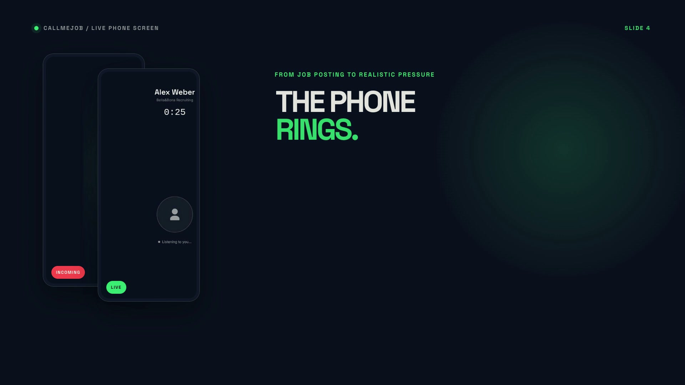

# CallMeJob

**The AI recruiter that calls you and trains you for real job interviews.**

Paste a real job posting. Your phone rings: a full-screen incoming call from "{Company} Recruiting". An AI recruiter runs a first-round phone screen tailored to that exact job, scores you, and calls again until you're ready.

## 🎥 Demo video

[](public/demo/callmejob-launch-short.mp4)

▶️ **[Watch the 56-second product demo](public/demo/callmejob-launch-short.mp4)**<br>
🚀 **[Try the live demo](https://callmejob.vercel.app)**

## What it does

- **Job-posting-tailored voice interviews**: a live ElevenLabs Conversational AI recruiter, briefed on the exact company, role, and requirements you pasted
- **CV upload**: the recruiter probes what you actually claim, and feedback checks your answers against it
- **Difficulty & duration selection**: pick how hard and how long each round should be; repeat rounds get sharper
- **Scoring with actionable feedback**: an honest 0-100 score, a verdict, and concrete fixes quoting what you actually said
- **Pitch mode**: practice your startup pitch against AI VC personas instead of recruiters

## Tech stack

- Next.js 14 (App Router)
- TypeScript
- Tailwind CSS
- ElevenLabs Conversational AI
- OpenAI

## Getting started

```bash
git clone https://github.com/bene1106/CallMeJob.git
cd CallMeJob
npm install
```

Create `.env.local` with:

```
OPENAI_API_KEY=sk-...
NEXT_PUBLIC_ELEVENLABS_AGENT_ID=agent_...
```

Then run the dev server:

```bash
npm run dev
```

## Live demo

👉 [callmejob.vercel.app](https://callmejob.vercel.app)

---

Built at **8x × Bella&Bona Mobile Hack Berlin, August 2026**.
